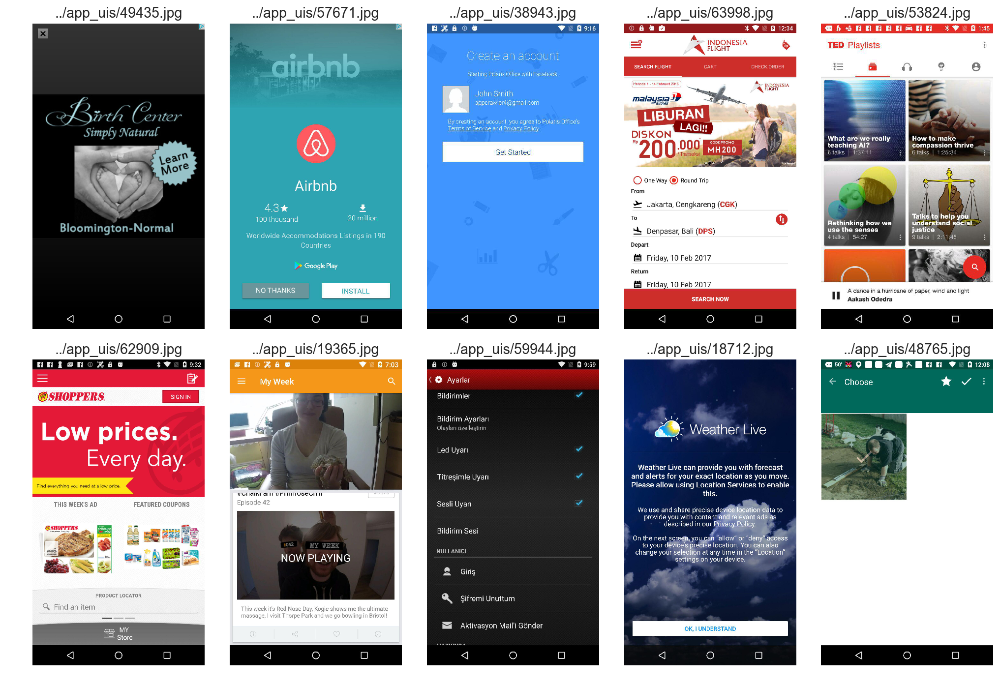
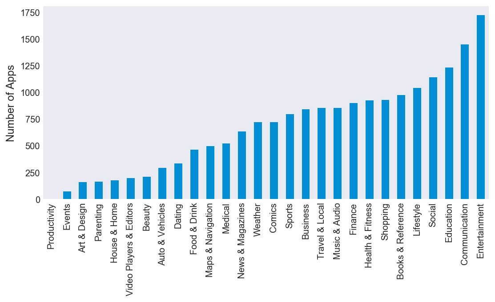
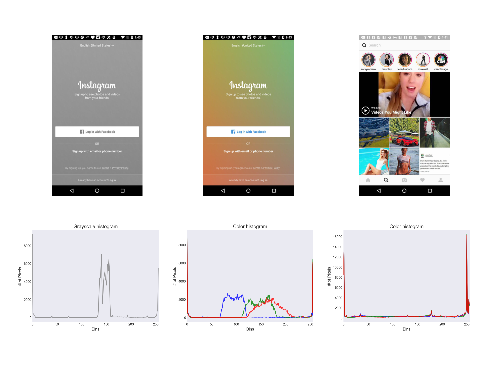
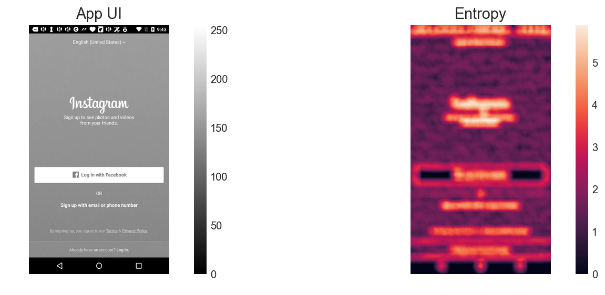
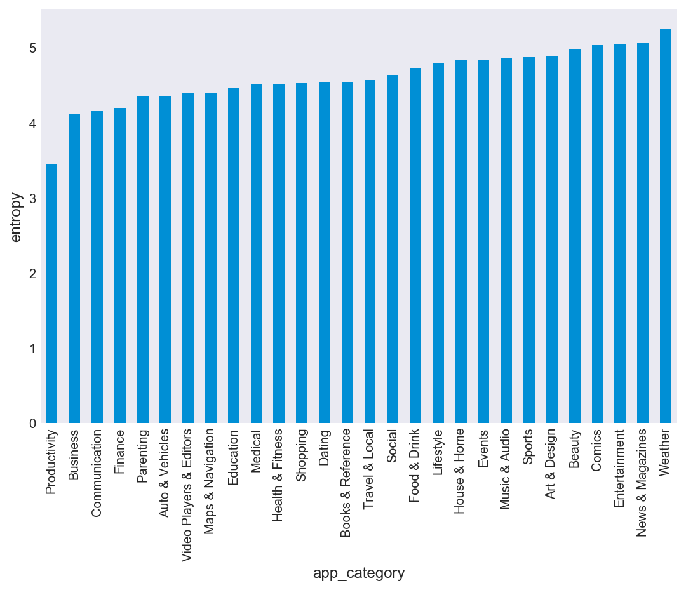
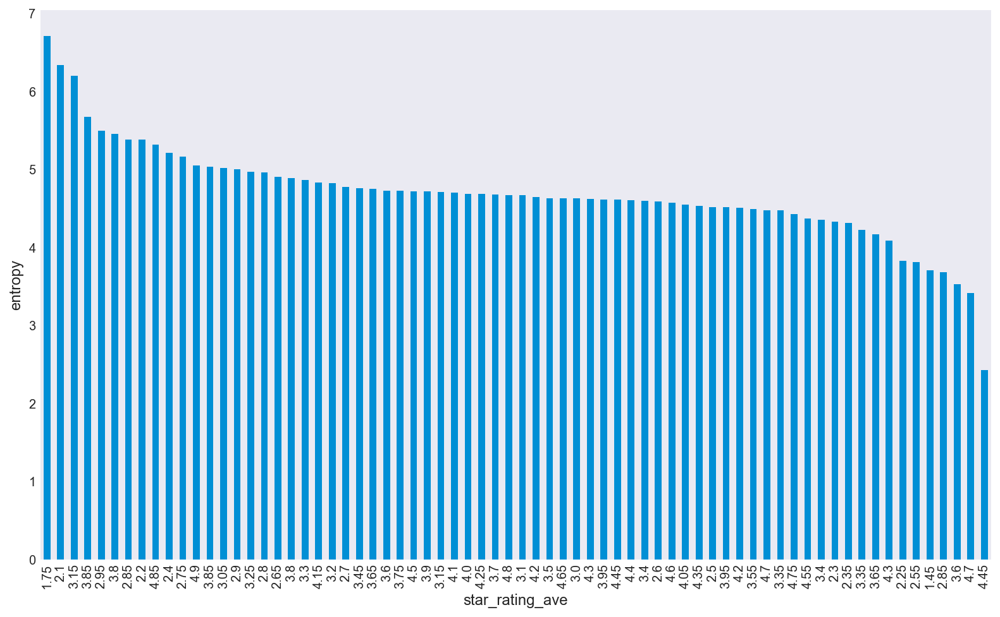

# Information Theory based UI Analysis

The [dataset](http://interactionmining.org/rico) is comprised of over 72k unique free app UI screens mined from the Android app store. Below is a sample of a few of these UI images:

These apps span across 28 different categories:

These UIs were analyzed by examining pixel intensity distributions (histograms), entropy, KL divergence, and information gain:

The goal of this project was to determine if entropy is a good proxy for app category and app rating:

